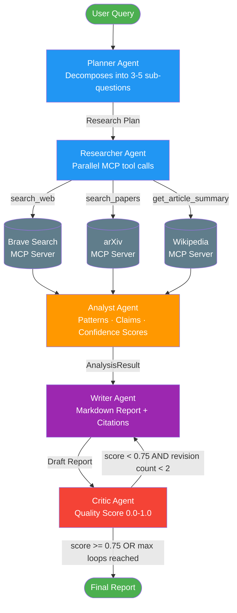

# 🔬 AgentForge

> **A production-grade multi-agent research engine** powered by LangGraph, MCP (Model Context Protocol), and Anthropic Claude. Ask any complex research question and receive a cited, peer-reviewed-quality report — automatically.

[](https://github.com/KazukiNoSuzaku/AgentForge/actions/workflows/ci.yml)
[](https://codecov.io/gh/KazukiNoSuzaku/AgentForge)


---

## Demo

> 📽️ *[GIF demo — run `streamlit run streamlit_app.py` to see it live]*

```
Query: "Compare the AI regulatory frameworks in the EU, US, and China"

🔵 [PLANNER]    Decomposed into 5 sub-questions
🟢 [RESEARCHER] Collected 23 findings (Brave: 10, arXiv: 8, Wikipedia: 5)
🟡 [ANALYST]    Identified 4 patterns, 2 contradictions, 8 claims
🟣 [WRITER]     Generated 1,847-word report with 6 citations
🔴 [CRITIC]     Quality score: 0.82 — Approved ✓

✅ Research complete in 87 seconds
```

---

## Architecture



---

## Quick Start

### 1. Clone and install

```bash
git clone https://github.com/yourusername/AgentForge.git
cd AgentForge
python -m venv .venv
source .venv/bin/activate  # Windows: .venv\Scripts\activate
pip install -r requirements.txt
```

### 2. Configure environment

```bash
cp .env.example .env
# Edit .env with your API keys:
# - ANTHROPIC_API_KEY (required)
# - BRAVE_SEARCH_API_KEY (recommended — free tier: 2,000 queries/month)
# - OPENAI_API_KEY (optional — enables LLM fallback)
```

### 3. Run the Streamlit UI

```bash
streamlit run streamlit_app.py
```

### 4. Or use the CLI

```bash
python main.py "Compare AI regulatory frameworks in the EU, US, and China"

# Save to file
python main.py "What caused the 2008 financial crisis?" --output report.md

# Verbose mode (shows agent thinking steps)
python main.py "Quantum computing threats to cryptography" --verbose
```

### 5. Run tests

```bash
pytest tests/ -v --cov=src
```

---

## Example Output

**Query**: *"Compare AI regulatory frameworks in the EU, US, and China"*

**Output excerpt** (see [full example](examples/sample_output.md)):

> The EU Artificial Intelligence Act employs a risk-based classification scheme that stratifies AI applications into four tiers [1]. Unlike the EU, the United States has not enacted omnibus federal AI legislation; instead, the NIST AI Risk Management Framework provides voluntary guidance [2]. China has enacted sector-specific regulations including the Algorithm Recommendation Regulations (2022) and Generative AI Measures (2023), with an emphasis on content control and national security [4][5].

**Pipeline metrics:**
- Sources retrieved: 18 (Brave: 7, arXiv: 6, Wikipedia: 5)
- Claims extracted: 8 (5 high-confidence >= 0.8)
- Quality score: 0.82
- Revisions: 0
- Total time: ~90 seconds

---

## Project Structure

```
AgentForge/
├── README.md
├── requirements.txt
├── .env.example
│
├── main.py                    # CLI entry point (Rich terminal output)
├── streamlit_app.py           # Real-time Streamlit UI
│
├── src/
│   ├── config.py              # Typed Pydantic Settings (loads .env)
│   ├── state.py               # LangGraph TypedDict state schema
│   ├── graph.py               # LangGraph graph + conditional routing
│   │
│   ├── agents/
│   │   ├── planner.py         # Query decomposition → ResearchPlan
│   │   ├── researcher.py      # Parallel MCP searches → ResearchFindings
│   │   ├── analyst.py         # Synthesis → AnalysisResult with claims
│   │   ├── writer.py          # Report generation + revision mode
│   │   └── critic.py          # Quality scoring + revision decision
│   │
│   ├── mcp_servers/
│   │   ├── brave_search.py    # FastMCP server: search_web, search_news
│   │   ├── arxiv_search.py    # FastMCP server: search_papers, get_paper
│   │   └── wikipedia.py       # FastMCP server: get_article_summary, search
│   │
│   ├── models/
│   │   └── schemas.py         # All Pydantic models (SubQuestion, ResearchFinding, etc.)
│   │
│   └── utils/
│       ├── llm.py             # LLMManager: Anthropic primary, OpenAI fallback
│       └── citations.py       # Citation map building, bibliography formatting
│
├── tests/
│   ├── conftest.py            # Shared fixtures and mock data
│   ├── test_planner.py
│   ├── test_researcher.py
│   ├── test_analyst.py
│   ├── test_writer.py
│   ├── test_critic.py
│   └── test_graph.py
│
├── examples/
│   └── sample_output.md       # Full example report (EU/US/China AI regulation)
│
└── docs/
    └── architecture.md        # Design decisions and trade-off analysis
```

---

## Tech Stack

| Technology | Role | Why This Choice |
|-----------|------|----------------|
| **LangGraph** | Agent orchestration | Explicit state machine with conditional edges — gives full control over the revision loop that CrewAI's role-based DSL cannot cleanly express |
| **MCP SDK** (`mcp`) | Tool protocol | Standard protocol for LLM-to-tool communication; MCP servers are reusable across any MCP-compatible client |
| **Anthropic Claude** | Primary LLM | Best-in-class instruction following and structured output reliability for research tasks |
| **OpenAI GPT-4o** | Fallback LLM | Automatic failover if Anthropic API is unavailable; same LangChain interface |
| **Pydantic v2** | Data validation | Type-safe state and agent outputs; eliminates a class of runtime errors at agent boundaries |
| **Streamlit** | Frontend | Rapid iteration on the UI with native Python; no JavaScript required |
| **arXiv SDK** | Academic search | Official Python client with proper rate limiting and structured Paper objects |
| **Wikipedia SDK** | Reference search | Disambiguation handling and section-level extraction out of the box |
| **httpx** | HTTP client | Async-first design fits naturally into the asyncio pipeline |
| **Rich** | CLI formatting | Beautiful terminal output without the overhead of a full TUI framework |
| **pytest** | Testing | Ecosystem standard; `pytest-asyncio` and `pytest-mock` cover all async/mock patterns |

---

## Agent System Prompts

Each agent has a carefully crafted system prompt defining its role and output format:

| Agent | Primary Responsibility | Output Schema |
|-------|----------------------|--------------|
| **Planner** | Query decomposition, sub-question generation | `ResearchPlan` |
| **Researcher** | Multi-source search, relevance scoring | `List[ResearchFinding]` |
| **Analyst** | Pattern identification, claim extraction | `AnalysisResult` |
| **Writer** | Report generation with citations | `str` (markdown) |
| **Critic** | Quality scoring, hallucination detection | `CriticFeedback` |

---

## MCP Servers

Each MCP server is a standalone process that can be used with **any MCP-compatible client**.

### Brave Search Server
```bash
python src/mcp_servers/brave_search.py
# Tools: search_web(query, count, country, freshness)
#        search_news(query, count, country, freshness)
```

### arXiv Server
```bash
python src/mcp_servers/arxiv_search.py
# Tools: search_papers(query, max_results, sort_by, category)
#        get_paper(arxiv_id)
#        search_papers_by_author(author_name, max_results)
```

### Wikipedia Server
```bash
python src/mcp_servers/wikipedia.py
# Tools: search_wikipedia(query, num_results, language)
#        get_article_summary(title, sentences, language)
#        get_article_sections(title, section_title, language)
#        get_article_references(title, language)
```

---

## Design Decisions

### Why LangGraph over CrewAI?

The Critic→Writer revision loop requires **conditional edges** with bounded iteration — a state machine primitive. LangGraph exposes this via `add_conditional_edges()` as a first-class feature. CrewAI's role-based DSL abstracts control flow away, making bounded loops require workarounds. LangGraph also provides fine-grained state control via Annotated TypedDict reducers, and its `stream()` method yields node-by-node updates that power the real-time Streamlit UI.

### Why MCP over Direct API Calls?

MCP standardizes LLM-to-tool communication so search servers are **reusable across any MCP-compatible client** (Claude Desktop, VS Code, AgentForge). It enforces separation of concerns — the Researcher agent doesn't manage HTTP clients or API keys, it just calls `session.call_tool()`. Adding a new data source means writing a new MCP server, not modifying agent code.

### Why a Critic Revision Loop?

LLMs hallucinate citations. A single-pass Writer has no feedback signal. The Critic provides structured quality assessment across five dimensions (citation accuracy, completeness, logical consistency, balanced perspective, factual grounding) and can send the draft back with specific, actionable feedback. The 2-revision cap prevents infinite loops while allowing meaningful improvement.

See [docs/architecture.md](docs/architecture.md) for the full analysis including performance characteristics and trade-offs.

---

## Metrics & Evaluation

### Runtime Metrics (tracked per run)

| Metric | Definition | Target |
|--------|-----------|--------|
| `quality_score` | Critic's final assessment (0–1) | >= 0.75 |
| `total_sources` | Unique sources retrieved | >= 8 |
| `high_confidence_claims` | Claims with confidence >= 0.8 | >= 3 |
| `revision_count` | Writer→Critic loops | <= 2 |
| `duration_seconds` | End-to-end wall time | <= 150s |

### Offline Evaluation

For batch evaluation on known research topics:
1. **Coverage (ROUGE-L)**: Compare report content against a gold-standard reference
2. **Factual Accuracy (G-Eval)**: Use an LLM judge to score claims against Wikipedia ground truth
3. **Citation Validity**: Automated URL reachability + anchor-text matching
4. **Hallucination Rate**: Fraction of claims not traceable to retrieved sources

---

## Configuration Reference

```bash
# Required
ANTHROPIC_API_KEY=sk-ant-...

# Recommended
BRAVE_SEARCH_API_KEY=BSA...
OPENAI_API_KEY=sk-...         # LLM fallback

# Tunable
ANTHROPIC_MODEL=claude-sonnet-4-5
LLM_TEMPERATURE=0.2
MAX_REVISION_LOOPS=2          # 0 = disable Critic loop (faster, lower quality)
QUALITY_THRESHOLD=0.75        # Score below which revision is triggered
MAX_SUB_QUESTIONS=5
MAX_SEARCH_RESULTS=10
```

---

## Development

```bash
# Run all tests with coverage
pytest tests/ -v --cov=src --cov-report=html

# Run a specific test module
pytest tests/test_planner.py -v

# Lint and format
ruff check src/ tests/
ruff format src/ tests/
```

### Adding a new data source

1. Create `src/mcp_servers/my_source.py` using `FastMCP`
2. Add a search function in `src/agents/researcher.py` following the `search_brave()` pattern
3. Add the new search to `ResearcherAgent.research()` via `asyncio.gather`
4. Write tests

---

## License

MIT License — see [LICENSE](LICENSE) for details.

---

## Acknowledgments

- [LangGraph](https://github.com/langchain-ai/langgraph) — Agent orchestration framework
- [Model Context Protocol](https://modelcontextprotocol.io) — Open standard for LLM tool communication
- [Anthropic Claude](https://www.anthropic.com) — Primary LLM
- [arXiv](https://arxiv.org) — Open-access academic research

---

*Built as a portfolio project demonstrating production-grade multi-agent AI system design.*
